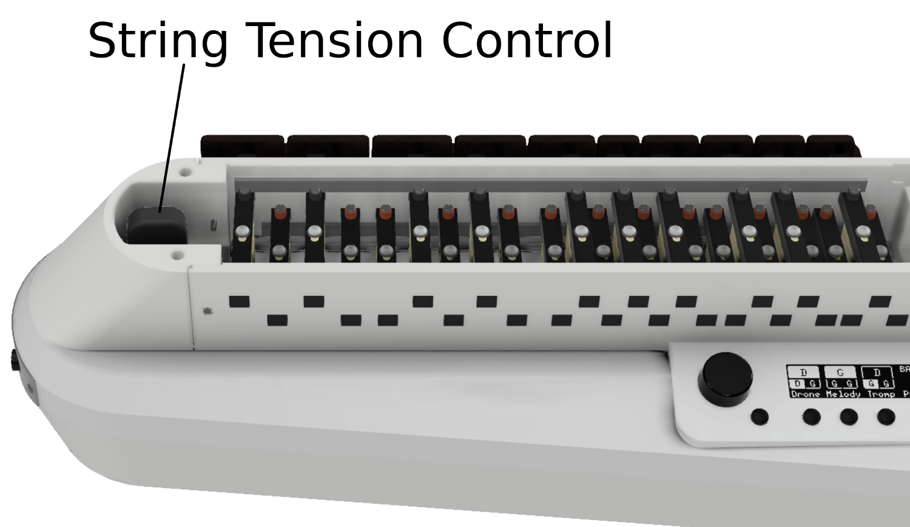
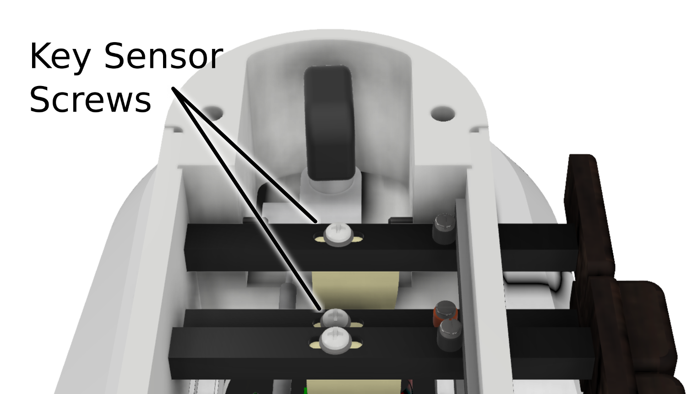

Adjusting the Keyboard
======================

The MidiGurdy allows you to adjust some of the mechanical aspects of the
keyboard in order to match them to your liking or to recreate some of the
playing feel of your acoustic hurdy-gurdy.

There are two properties you can change:

#. the tension of the string inside the tangent box
#. the travel of the keys before hitting the string.

Opening and closing the tangent box lid
---------------------------------------

Open up the tangent box lid by grabbing the protruding end on the side towards
the wheel cover. Push or pull it upwards with a little force to separate it
from the magnets holding it in place. The lid is connected to the body via a
small cable, so please make sure you don’t pull the lid away too far without
unplugging the cable.

Once you've made your adjustments, replace the lid and the magnets should make
it snap into place.

Changing the string tension
---------------------------

    Location of the string tension tuner

Inside the tangent box you see the instrument tuner near the front of the
instrument. Turn the knob on the tuner clockwise to increase the string tension
or anti-clockwise to decrease the tension.

.. admonition:: Always make small adjustments
    :class: warning

    Always make only small adjustments to the string tension and check if the
    playing feel has changed to your liking. Increasing the tension too much
    might damage the instrument!

Changing the key travel
-----------------------

    Location of the key sensor screws

The key travel can be adjusted for each individual key by changing the position of the key sensor.

#. Use a small Phillips screwdriver to loosen the screw holding the sensor in
   place a little bit.

#. Use the screwdriver to shift the screw and attached key sensor forwards or
   backwards. You might need to use a little force to move it the first time.
   Pressing down on the screw or lifting it with a fingernail might help to get
   it to move more freely.

#. Once you have positioned the key sensor, tighten the screw again, but only
   very lightly.

.. admonition:: Only loosen the screws
    :class: warning

    Only unscrew the key sensor a small amount until you can move it. Do not
    unscrew it all the way, otherwise the key sensor might drop away from the
    key, making it very difficult to get it back into place!

.. admonition:: Do not tighten with a lot of force
    :class: warning

    Only tighten the screws of the key sensor with a small amount of force!
    Ideally you should use a screwdriver with a thin handle to turn the screw,
    reducing the force you can apply to the screw.  The key sensor will hold in
    place even when the screw is not very tightly secured!

Recalibration
-------------

The key sensors are very sensitive to the amount of force with which they are
pressed against the string. This means that larger changes to the string
tension or a significant change in key travel might make it necessary to
recalibrate the keyboard sensors.

To recalibrate the keyboard, please connect the MidiGurdy to a computer to
access the Web-Interface. Then choose the recalibration function from the
Advanced menu.
