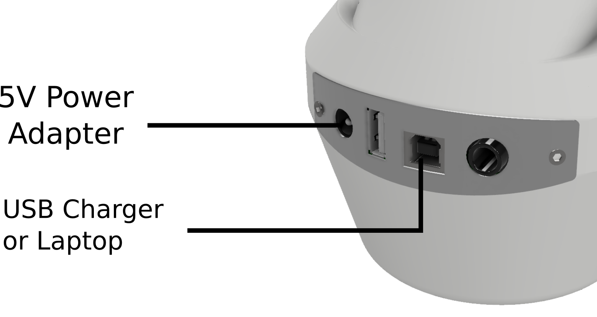
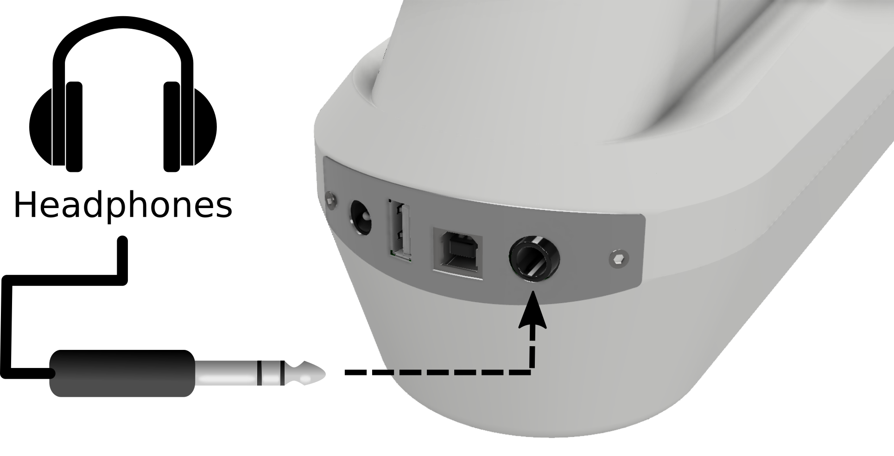
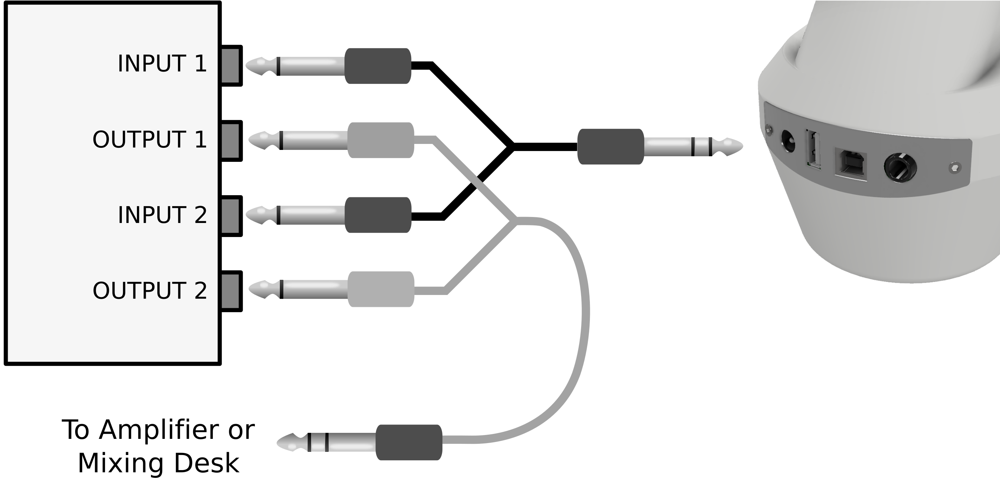

Connections
===========

The connectors at the front of the MidiGurdy connect the instrument with all
external components and devices.

Power Supply
------------

    The MidiGurdy power connections

The MidiGurdy can be powered from three different sources:

#. By inserting eight AA / R6 / Mignon batteries or rechargeable batteries

#. By attaching the included 5V power supply

#. By attaching the USB-B port to another USB device like a computer, laptop or
   phone charger via a suitable USB cable

All three power sources can also be connected at the same time. The MidiGurdy
will always choose the best source available and show the currently selected
source in the top right corner of the display.

When the 5V power supply is connected, the instrument will always be powered
via this source and will draw no power from the batteries or the USB port. When
powered via USB and batteries, the instrument will mainly draw power from the
USB connection and only fall back to the batteries if the USB connection cannot
supply enough current.

.. admonition:: Concerning Batteries

    The MidiGurdy is designed to be used with eight AA batteries (also called R6 or
    Mignon cells). Either primary (disposable) or secondary (rechargeable) cells
    can be used. We recommend high-capacity 2500mAh NiMH rechargeable batteries,
    which will give you an estimated 10 – 12 hours of solid playing time.

    The MidiGurdy does not contain a battery charger. If you use rechargeable
    batteries (which we highly recommend), you will need an external charger to
    bring them back to charge.

.. warning::

    Always replace all batteries when inserting fresh batteries into the
    instrument, never replace only individual cells.

    Please check the polarity of the batteries carefully before inserting them
    into the instrument!

Headphones
----------

    Connecting headphones to the MidiGurdy

The MidiGurdy outputs all sound via the 6,3mm (¼ inch) stereo jack connector.
Simply insert the headphones and adjust the volume of the instrument to
comfortable levels. See :ref:`volume-menus` on how to change the volume.

.. _other-sound-equipment:

Other Sound Equipment
---------------------

    Connecting other sound equipment

To connect the MidiGurdy to an amplifier, a mixing console, recording device or
other sound equipment, please use the supplied Y-cable and breakout box
("DI-box"). Connect the single stereo plug of the Y-cable to the headphone jack
of the MidiGurdy and the two mono plugs to the ports on the breakout box
marked "Input 1" and "Input 2". Then connect one or both “Output” ports of the
breakout box to the amplifier or other sound equipment.

.. _usb-connection:

Data Connection to Computer or Tablet via USB
---------------------------------------------

To connect the MidiGurdy with a desktop computer, tablet or other device please
use a USB-A to USB-B cable, as used for most USB printers.

Once connected, the MidiGurdy will act as two separate USB devices via this
connection:

* as a USB network card
* as a USB-MIDI controller

Both function use a standard implementation and should therefore work on any
modern computer or tablet without installing additional drivers.

.. note::
    If your device provides enough power via the USB port, the MidiGurdy will use
    this connection to power itself, unless the 5V power supply (see above) is
    plugged in.

For more information on how to use the MidiGurdy via the USB connection, please
refer to section :ref:`web-interface`.

External Synthesizer via USB-MIDI Connection
--------------------------------------------

The MidiGurdy provides a standard USB-MIDI connection via the USB-B port and
can therefore be used to control external synthesizers or other MIDI capable
devices that have a USB-MIDI interface.

Simply attach the MidiGurdy with a suitable USB-A to USB-B cable as shown in
the picture above.

The USB-MIDI connection setup can be configured via the web interface of the
MidiGurdy. Please see the section :ref:`web-interface` for more details.
