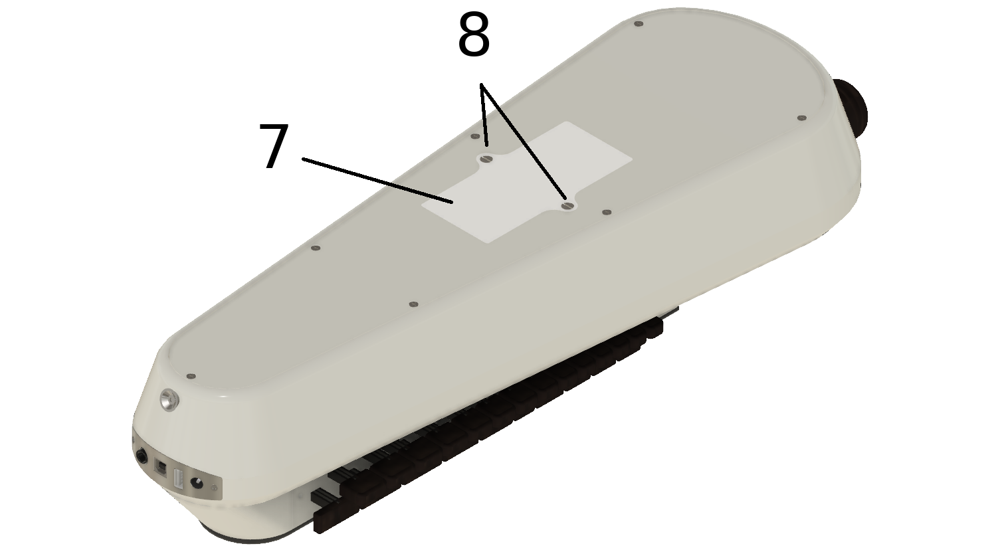
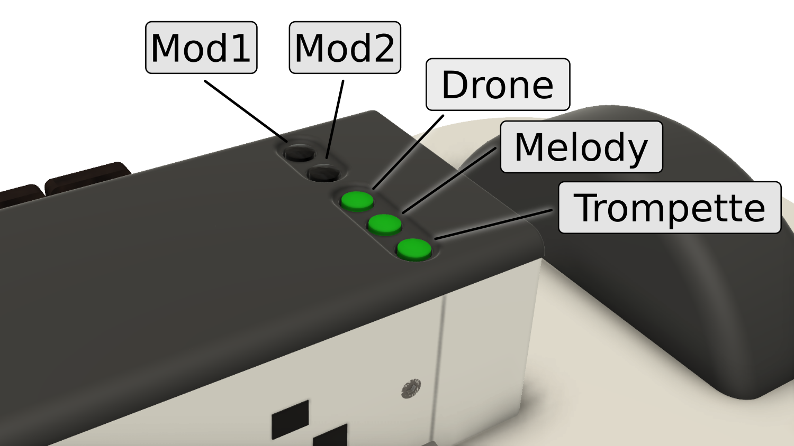

Getting to know the MidiGurdy
=============================

In many ways the MidiGurdy works very similar to other hurdy-gurdies, but there
are a few differences that you should be aware of. The MidiGurdy also offers
many functions that you won‘t find on an acoustic instrument, which this manual
will explain in detail.

In this section we will explore the mechanical features of the instrument and
learn about the user controls and the connectors available on the MidiGurdy.

Mechanical Features
-------------------

    The mechanical features of the MidiGurdy

(1) Keyboard
~~~~~~~~~~~~

The keyboard of the MidiGurdy works like most hurdy-gurdies and uses gravity
for the keys to fall back into their original position. This requires you to
tilt the instrument forward while playing.

(2) Tangent box lid
~~~~~~~~~~~~~~~~~~~

The tangent is covered by a wooden lid that is held in place using four
magnets.

(3) Crank
~~~~~~~~~

The crank also works like you would expect from a hurdy-gurdy. You can turn it
forwards, backwards, shake it and use it to sound the trompette by giving
shorter or longer impulses while turning. The turning speed also affects the
volume of the instrument.

(4) Wheel Cover
~~~~~~~~~~~~~~~

The wheel cover can be lifted by grabbing it on both sides and simply lifting
it upwards with a little force.  Once the cover is removed, you can grab the
wheel to attach or remove the crank.  To close the cover again, carefully
insert it into the cut-out around the wheel and push down with a little force
until you hear it snap into place.

(5) Wheel Brake Control
~~~~~~~~~~~~~~~~~~~~~~~

The black knob right next to the wheel cover controls the wheel brake. It is
used to adjust the amount of resistance that you feel while turning the crank,
simulating strings pressing down onto the wheel. Turn right to pull it tighter
and increase the required force, turn left to loosen the brake and reduce the
required force.  Always turn the crank while adjusting the brake to avoid
overloading the wheel and axle! Excessive force on the brake might damage the
parts of the braking system.

(6) Front panel connectors
~~~~~~~~~~~~~~~~~~~~~~~~~~

The front panel contains all connectors used to interface the MidiGurdy with
external components.  We will have a closer look at the individual input and
output ports in the next section.  Instrument strap pins There are three
instrument strap pins: one at the front and two pins at the back.

    Location of the battery compartment

(7) Battery Compartment
~~~~~~~~~~~~~~~~~~~~~~~

The battery compartment can be used to power the MidiGurdy via eight
AA/R6/Mignon batteries. Please ensure correct polarity of the batteries when
inserting them into the instrument.

(8) Battery Compartment Screws
~~~~~~~~~~~~~~~~~~~~~~~~~~~~~~

The lid of the battery compartment is secured in place with two slotted screws.
Use a suitable screwdriver to remove or tighten both screws. Please do not use
excessive force then tightening the screws.

Tangent box lid buttons
-----------------------

There are two distinct sections that are used to control the many different
functions of the MidiGurdy: the five buttons in the tangent box lid and the
main user interface.

    Buttons in the tangent box lid

The lid of the tangent box contains five buttons, arranged in two groups. Let’s
look at the group of three buttons closest to the player first, called the
“String Buttons“.

The String Buttons (Drone, Melody, Trompette)
~~~~~~~~~~~~~~~~~~~~~~~~~~~~~~~~~~~~~~~~~~~~~

These buttons are used to switch individual strings on and off (lift them on
and off the wheel). The order of the buttons follows the string positions on
an acoustic hurdy-gurdy:

*   **Drone string**, closest to the keyboard

*   **Melody string**, in the middle

*   **Trompette string**, closest to the player

Press any of these buttons, turn the crank and notice how the string sound gets
switched on or off. An illuminated button means the string is currently
switched on.

The String Set Buttons (Set 2 and Set 3)
~~~~~~~~~~~~~~~~~~~~~~~~~~~~~~~~~~~~~~~~

The two black buttons on the tangent box lid are called the “String Set“
buttons.  As the MidiGurdy only has one button for each string type (drone,
melody, trompette) but three possible strings for each type, the string set
buttons can be used to control the other two strings of each type.

If you only press the String Buttons **Drone**, **Melody** or **Trompette** you
are switching the first string of each type.

If you want to control the second string of any type, simply hold the **Set 2**
button while pressing any of the string buttons.

If you want to control the third string of any type, simply hold the **Set 3**
button while pressing any of the string buttons.

As soon as you press one of the String Set buttons, the illumination of the String
Buttons changes to indicate the on/off state of the drone, melody and trompette
string in that set.

The String Set buttons only affect which strings you switch on and off with the
String Buttons.  They have no other effect on the instrument.  You can mix and
match strings from different string sets while playing, or even play all nine
strings simultaneously.

User Interface
--------------

    The main user interface of the MidiGurdy

The main user interface of the MidiGurdy consists of the display, a rotary knob
and five buttons.  First a short overview explaining the most important
functions of the interface. For a detailed description of the settings and the
menu system, please see the section :ref:`menu-system`.

Display
~~~~~~~

The display of the MidiGurdy is used to show you the current setup of the
instrument and is used to display all settings and menu items. By default it
shows the so called “Home Screen“ which informs you about the current tuning
and on/off state of all strings, the currently selected preset, how the
instrument is powered and the estimated battery charge in case you are running
on batteries (see :ref:`menu-system` for more details).

Rotary knob (ROT)
~~~~~~~~~~~~~~~~~

You can turn this knob left and right and also press it like a button.  Turning
the knob is used to navigate the menu system or to increase or decrease values.
Pressing the knob usually selects a menu item or confirms a changed value.

Back button (BACK)
~~~~~~~~~~~~~~~~~~

The back button is right next to the rotary knob. Regardless on where you are
in the menu system, pressing this button will always cancel the current
selection or operation, bring you back to the previous screen and eventually
back to the Home screen.

Display Buttons (D1 D2 D3 D4)
~~~~~~~~~~~~~~~~~~~~~~~~~~~~~

The four buttons under the display are called the “Display Buttons” and
activate different functions depending on the currently active menu. By
default, the first three buttons activate the configuration menus for

* the drone strings **D1**
* the melody strings **D2**
* the trompette string **D3**

as indicated by their labels in the display on the Home Screen.

The rightmost button **D4** is also called the “Power / Settings” button.  As
the name suggests, this button is used for multiple purposes:

1. Switching the MidiGurdy on and off:

    * Hold this button for about 1 second to switch the instrument on

    * Hold this button for about 4 seconds to switch the instrument off again

    * Hold this button for about 8 seconds and release it again to do a
      forced restart of the instrument. Use this if the MidiGurdy has locked
      up and doesn't react to any user input any more (which hopefully will
      never happen!)

2. Opening the Presets and Settings menus with a short press of the button
