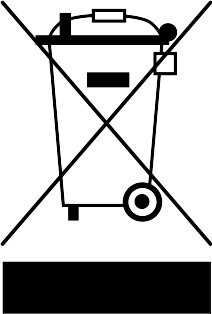

Important notes
===============

Handling and maintenance
------------------------

.. warning::

    Always grab the instrument by the body or the rear tangent box support.
    Never carry or lift the instrument by the keyboard or individual keys!

*   Use a soft, dry cloth to clean the instrument, which may be slightly moistened if necessary.

*   Never use petrol, thinner, alcohol or similar cleaning agents to avoid
    damaging or discolouring the surface of the instrument.

*   All user-adjustable screws and controls should only ever be hand-tightened.
    Never tighten the screws or tuning knobs with great force.

Precautions for batteries
-------------------------

* The required ambient temperature depends on the batteries used. Refer to the
  battery documentation. Never use or store the batteries in extremely hot
  places, e.g. in direct sunlight, in a closed vehicle or near a radiator. This
  could lead to leakage of battery fluid and shorten the battery life.

* Keep the batteries dry and ensure that the connections are never exposed to
  moisture. This could lead to overheating or rusting on the battery and on the
  connections.

* Make sure that batteries are never within the reach of small children.

* Never hit the batteries or drop them. Strong shocks can lead to leakage of
  battery fluid, excessive heat generation, explosion or fire.

Further Precautions
-------------------

* Handle the controls and connectors of the instrument with due care.
  Excessive handling can lead to damage.

* Never press or hit the display or place heavy objects on it.

* When making or removing the connections, pull only on the plugs - never on
  the cables. This will prevent any damage to the cables and the instrument.

.. warning::

    The instrument should only be serviced by an expert. Before opening the
    base plate, the instrument must be disconnected from all power sources
    (power supply, USB connection, battery).

.. danger::

    Only use the original 5V power supply to power the instrument via the
    power connector.  And only connect the 5V power supply to a suitable
    power outlet. Never plug it into an outlet of another voltage.

Notice regarding disposal (EU only)
-----------------------------------

When this “crossed-out wheeled bin” symbol is displayed on the product, owner’s
manual, battery, or battery package, it signifies that when you wish to dispose
of this product, manual, package or battery you must do so in an approved
manner.

Do not discard this product, manual, package or battery along with ordinary
household waste. Disposing in the correct manner will prevent harm to human
health and potential damage to the environment.

Since the correct method of disposal will depend on the applicable laws and
regulations in your locality, please contact your local administrative body for
details. If the battery contains heavy metals in excess of the regulated
amount, a chemical symbol is displayed below the “crossed-out wheeled bin”
symbol on the battery or battery package.
