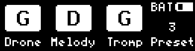
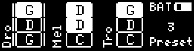

.. _instrument-modes:

Instrument Modes
================

Once you are familiar with the way the MidiGurdy works, you can customise it's
behaviour and extend the capabilities of the instrument.

The different instrument modes allow you to configure the **number of strings**
in your MidiGurdy and the behaviour of the **lid buttons** S1 S2 S3 and Mod1
Mod2.

    The lid buttons affected by the instrument mode

The following modes are available:

3 Strings (the default mode)
~~~~~~~~~~~~~~~~~~~~~~~~~~~~

This is the default mode of the MidiGurdy. It provides one melody, one drone
and one trompette string.

**Lid Buttons with 3 Strings**

* S1, S2, S3 are used to switch the drone, melody and trompette strings on / off.
* Mod1 and Mod2 can be used to load the previous and next preset.

    The home screen in "3 Strings" mode

6 Strings
~~~~~~~~~

This mode gives you an additional set of melody, drone and trompette strings,
bringing the MidiGurdy to a toal of 6 strings.

**Lid Buttons with 6 Strings**

* S1, S2, S3 are used to switch the drone, melody and trompette of the **current set** on / off.
* Mod1 loads the previous preset with a **long press**, the next preset with a **short press**.
* Mod2 switches which **string set** the S1, S2 and S3 buttons control.

**Home Screen with 6 Strings**

The home screen uses a different layout in two strings mode. It shows two rows of strings,
each row represents one **string set**. Which string set is active is shown by the vertical
lines next to the string indicators.

    The home screen in 6 String mode with the first string set active

    The home screen in 6 String mode with the second string set active

**String Menus with 6 Strings**

As you now have two strings of each type, you also have two string menus each. For example,
pressing D2 will open the first melody string menu, pressing D2 again will switch to the second
melody string menu. Which string you are currently editing is shown in on the left.

    The two string menu indicators after pressing D2 repeatedly.

9 Strings, grouped by number
~~~~~~~~~~~~~~~~~~~~~~~~~~~~

The 9 Strings mode gives you yet another additional set of melody, drone and
trompette strings, bringing the MidiGurdy to a toal of 9 strings.

The first variant of the 9 Strings modes groupes the strings by number, just
like the 6 strings mode but with one additional set. The lid buttons work
slightly different though:

**Lid Buttons with 9 Strings, grouped by number**

* S1, S2, S3 are used to switch the drone, melody and trompette of the **current set** on / off.
* Switch between sets with **short presses** on Mod1 and Mod2.
* Switch between presets with **long presses** on Mod1 and Mod2.

**Home Screen with 9 Strings, grouped by number**

The home screen uses a similar layout to the 6 strings mode. It shows three rows of strings,
each row represents one **string set**. Which string set is active is shown by the vertical
lines next to the string indicators.

    The home screen in 9 Strings, grouped by number mode with the first string set active

    The home screen in 9 Strings, grouped by number mode with the second string set active

    The home screen in 9 Strings, grouped by number mode with the third string set active

**String Menus with 9 Strings**

The string menus gain an additional entry, just as with the 6 String mode. So
for example, pressing D2 will open the first melody string menu, pressing D2
again will switch to the second melody string menu. and pressing D2 a third
time switches to the third melody string menu. Which string you are currently
editing is shown in on the left.

.. figure:: images/menu_m123.png
    :width: 7cm
    :class: img-auto

    The three string menu indicators after pressing D2 repeatedly.

9 Strings, grouped by type
~~~~~~~~~~~~~~~~~~~~~~~~~~

This mode gives you nine strings, just like the previous mode. But it groupes the
strings in a different way. This only affects how you switch strings on and off
using the S1 S2 S3 buttons.

Grouping by string type means that S1 S2 S3 switch the first, second and third
string of the currently active type. If the currently active set is "melody",
then S1 switches melody 1, S2 melody 2 and S3 melody 3.

**Lid Buttons with 9 Strings, grouped by type**

* S1, S2, S3 are used to switch strings 1 - 3 or the **currrently active type**.
* Switch between presets **short or long presses** on Mod1
* Switch the active string type with **short or long presses** on Mod2.

**Home Screen with 9 Strings, grouped by number**

    The home screen in 9 Strings, grouped by type mode with the drone set active

    The home screen in 9 Strings, grouped by number mode with the melody set active

    The home screen in 9 Strings, grouped by number mode with the trompette set active

Old MidiGurdy Mode
~~~~~~~~~~~~~~~~~~

This is the way the MidiGurdy worked before configurable instrument modes were added:
9 strings, grouped by number.

**Lid Buttons**

* S1, S2, S3 are used to switch the drone, melody and trompette of the **current set** on /off.
* **Hold** Mod1 to select the second set
* **Hold** Mod2 to select the third set

(If you don't hold Mod1 or Mod2, the first set is active.)

Custom Mode
~~~~~~~~~~~

If you would like a different instrument setup that is not offered by these
predefined modes, you can also open the :ref:`web-interface` and choose a custom
setup of strings and how the lid buttons react in the "Settings" area.

