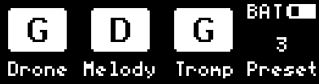
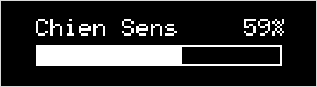
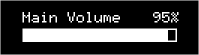
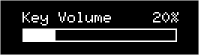
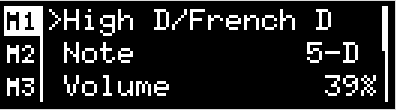
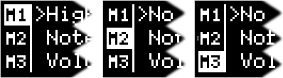
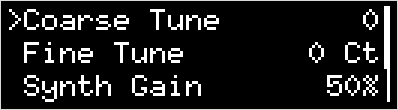

.. _menu-system:

The Menu System
===============

This section describes all menus and configuration items that are available on
the MidiGurdy.

Please note that there are extended features and advanced settings that are
only available via the Web Interface. Please see the :ref:`web-interface` on
how to access and use it.

Home screen
-----------

    The home screen of the instrument menu

The home screen shows the most important information about the current setup of
the instrument.  The MidiGurdy will always return to the home screen after a
configurable period of inactivity (see :ref:`configuration-menu`).

The largest part of the display is taken up by the visualisation of the
**current string state and tuning**. From left to right you see the state for
the drone, melody and trompette strings. Each area is divided into three
sections: the top row shows the first string of each type, the bottom left the
second and bottom right the third string. Enabled strings are shown with black
text on white background, disabled strings are shown with white text on black
background. Each section contains the currently chosen note for that particular
string.

As an example, the picture above shows that there are currently four active
strings: the first and second drone string, the first melody string and the
second trompette string. Drone strings are tuned to D, D and G, the melody
strings are all tuned to G and trompette strings are tuned to D, G, and G.  P
lease note that the display does not show the octave of the current tuning. To
see which octave a string is tuned to, you would have to open the respective
String Setup Menu (see below) by pressing the buttons under the string label.

In the top right corner of the home screen you can see the estimated charge of
the batteries as a small battery icon, as well as the currently active power
source:

* BAT – powered via batteries
* EXT – powered via 5V power supply
* USB – powered via USB connection

The bottom right corner shows the number of the last loaded preset. See below
for an explanation of the preset system.

**Available controls on the home screen:**

* Turn the rotary knob **ROT** left or right to open the Chien Sensitivity
  menu

* Press the rotary knob **ROT** to cycle through the volume menus for Main
  Volume, Reverb Volume and Key Volume.

Chien Sensitivity
-----------------

Probably one of the most important settings you will want to change on the
MidiGurdy is the sensitivity of the chien. On an acoustic hurdy-gurdy, you
would tighten or loosen the *tirant* for that. On the MidiGurdy, you simply
turn **ROT** left or right when you are on the Home Screen.

Turn right to make the chien more sensitive (to start buzzing at lower cranking
speeds), turn left to make it less sensitive.

.. admonition:: Single or separate chien sensitivity

    Please note that by default the chien sensitivity affects all three
    trompette strings at the same time. If you wish to control the three
    chien sensitivities separately, please enable this feature in the
    web-interface by going to "Advanced / Settings" and enabling the option
    "Separate chien sensitivities" in the "Features" box.

.. _volume-menus:

Volume Menus
------------

When you press the rotary knob ROT on the home screen, you reach the Main
Volume menu. Turn ROT left and right to decrease or increase the main volume of
the instrument.

Press **ROT** again to reach the Reverb Volume menu, turn it left and right to
decrease or increase the sympathetic string reverberation volume.
d

Press **ROT** again to reach the Key Volume menu, turn it left or right to
decrease or increase the volume of the simulated mechanical key noise.

The **BACK** button will bring you back to the Home Screen.

String Menus
------------

The String Menus are used to change the setup of all melody, drone and
trompette strings of the MidiGurdy.  You can access the String Menus by
pressing one of the first three buttons D1 D2 D3 under the display, labelled
“Drone”, “Melody” and “Tromp” (for Trompette).

These buttons always open up the String Menu, even when those labels are not
shown above the buttons. Only if you see other labels above the buttons will
their function be different.

When you press a String Menu button once, you open the String Menu for the
first string of the chosen type, as indicated by the bar on the left of the
screen. Press it again to choose the second string, and again to choose the
third string.

For example, if you press **D2** once, “M1” is selected in the left bar,
indicating that you are editing the first melody string. Press it again to to
edit the second melody string (“M2” is selected in the left bar) and again to
select to edit the third melody string (“M3” selected in the left bar).  The
drone and trompette buttons work in exactly the same way.

.. _common-string-items:

Common Menu Items
~~~~~~~~~~~~~~~~~

All three string types – melody, drone and trompette – start with the same
configuration items

* **Sound** – The first item in each String Menu shows the currently selected
  sound for the string, or “No sound...” if no sound has been selected. Press
  the rotary knob on this item to choose a sound from the list of installed
  Soundfonts.

* **Note** – Select this entry to choose the tuning of the string. The chosen
  note will either be the single continuous note you hear when turning the
  crank (for drone and trompette), or the fundamental note that you hear on the
  melody strings if you don’t press a key on the keyboard (the “open string”
  note).

* **Volume** – The volume of this string in percentage of the main volume. Use
  this setting to adjust the volume balance of the strings, for example to
  reduce the volume of drone and trompette to make the melody stand out more.

* **Balance** – This setting controls where you hear this string in the stereo
  panorama (left / right).

* **Fine Tune** – With this setting you change the fine tuning of the
  individual string in cent. 100 cent equal one semitone.

Melody String Items
~~~~~~~~~~~~~~~~~~~

In addition to the items common to all string types, the Melody String Menu
contains a few additional items that are only relevant for melody strings:

* **Capo** – Some acoustic hurdy-gurdies allow the player to lock one of the
  lower keys in a pressed state, effectively acting as a capo for all
  melody strings. This setting allows you to simulate that setup on the
  MidiGurdy, separately for each melody string.

* **Polyphonic** – Contrary to most acoustic hurdy-gurdies, you can choose to
  play the melody strings polyphonically. This means that when you press two or
  more keys at the same time, you will hear all notes simultaneously instead of
  just the note of the highest key.

* **Mode** – This setting controls how the physical controls (keyboard and
  crank) affect the sound generation on this string:

    * “Hurdy-Gurdy”: this mode simulates a hurdy-gurdy. The string will only
      produce a sound if the crank is turned and the keyboard reacts similar to
      an acoustic hurdy-gurdy. This mode is the default for all “generic”
      Soundfonts (i.e. Soundfonts which were not specifically created for the
      MidiGurdy).

    * “MidiGurdy”: this mode is very similar to the “Hurdy-Gurdy” mode, but
      adds extended sound control via the keyboard. This mode is mostly useful
      for Soundfonts which have been specifically created for the MidiGurdy and
      is the default for those Soundfonts.

    * “Keyboard”: in this mode, the string can be played as if the MidiGurdy
      were a piano. Sound is only controlled via the keyboard and you don’t
      need to turn the crank to hear a sound. The keyboard is
      velocity-sensitive, which means that the volume of the sound is dependent
      on how fast you press the keys.

Trompette String Items
~~~~~~~~~~~~~~~~~~~~~~

In addition to the items common to all string types, the Trompette String Menu
contains a few additional items that are only relevant for trompette strings:

* **Mode** – This setting controls how the wheel speed affects the sound
  generation of this string, especially how the chien sound is generated and
  controlled:

    * “MidiGurdy”: (default) This mode is the default and the correct mode
      for all hurdy-gurdy trompette / chien sounds designed for the MidiGurdy.

    * “Percussion”: this mode is useful if you want to use the chien of the
      trompette string to trigger other, non-hurdy-gurdy sounds like drums,
      percussion, plugged base or similar instruments. The string will only
      output sound if the chien would sound, the volume of the sound depends on
      how hard and fast the attach of your coup is.

Preset Menu
-----------

Presets allow you to save and load the setup of the instrument very quickly.
The MidiGurdy comes with a few pre-configured presets, but you can create your
own presets or edit existing presets to your liking.  To open the Preset Menu,
press D4 and the list of presets will appear.

Loading a preset
~~~~~~~~~~~~~~~~

To load a preset, select any numbered preset from the list with the rotary
knob, then do a short press on the rotary knob.

Saving a preset
~~~~~~~~~~~~~~~

To save the current instrument setup to a new preset, go to the last entry in
the preset list called “New preset...” and press the rotary knob.

A new screen will appear in which you can enter a name for the new preset.  The
first character of the name is highlighted and can be edited by turning ROT
left or right to move though the available characters. Pressing the rotary
knob after choosing a character moves to the next character position.

At the bottom of the screen you see new labels for the four buttons under the
display:

+-----+-------+-------+------+
| DEL | **<** | **>** | SAVE |
|     |       |       |      |
+-----+-------+-------+------+
| D1  | D2    | D3    | D4   |
|     |       |       |      |
+-----+-------+-------+------+

Press the buttons under the arrows **<** and **>** to change which character
you are currently editing (moving the cursor).

Press the button under DEL to delete the currently selected character and shift
all following characters to the left by one place.

Press the button under SAVE to accept the current name and save the preset.

You don’t have to enter a name to save a preset. In that case, the preset is
called “Unnamed” in the list of presets and can only be identified by it’s
number.

Editing a preset
~~~~~~~~~~~~~~~~

To edit an existing preset, select the preset you want to move with the rotary
knob and then do a **long press** on ROT to open the Edit Preset Menu.  The
chosen preset name will be displayed, along with four options: “Move”,
“Rename”, “ Replace” and “Delete”.  Select one of the options with the rotary
knob or press BACK to cancel the operation.

Moving a preset
~~~~~~~~~~~~~~~

When you choose “Move” in the Preset Edit Menu, the preset list will appear
with the chosen preset highlighted. Use the rotary knob to move it to the
desired position, then do a short press on the rotary knob to save the new
position. Or press the BACK button to cancel the operation.

Renaming a preset
~~~~~~~~~~~~~~~~~

When you choose “Rename” in the Preset Edit Menu, you will be presented with a
screen where you can modify the preset name. This screen works just in the same
way as if you would save a new preset (see “ Saving a preset” above).

Replacing a preset
~~~~~~~~~~~~~~~~~~

When you choose “Replace” in the Preset Edit Menu, the current instrument setup
will be stored over the preset you are currently editing, replacing everything
with the new setup.

Deleting a preset
~~~~~~~~~~~~~~~~~

When you choose “Delete” in the Preset Edit Menu, the currently selected preset
is deleted immediately and the following presets are shifted up automatically.

.. _configuration-menu:

Configuration Menu
------------------

The configuration menu contains many settings that affect the instrument as a
whole:

* **Coarse Tune** – shifts the tuning of all strings of the MidiGurdy up or
  down the given number of semitones.

* **Fine Tune** – shifts the tuning of all strings of the MidiGurdy up or down
  the given number of cents. The default tuning (Fine Tune = 0, Coarse Tune =
  0) of the instrument with the supplied Soundfonts is A=440Hz.

* **Pitch Bend** – controls the amount of pitch bend in cent that you will hear
  when pressing a key harder or softer. Increase this value for more pitch
  bend, decrease it for less. 100 cent equal one semitone.

* **Synth Gain** – Controls the amount of gain (amplification) used in the
  internal synthesizer. Depending on the sounds you have chosen for the strings
  and the volume of the samples in the Soundfont, you might have to increase
  the gain to reach the desired volume or decrease the gain to avoid digital
  distortion and clipping in the synthesizer.

* **Keynoise…** - opens a menu similar to the String Menu where you can choose
  the sound of the key noise channel and change the volume and stereo balance
  of the key noise.

* **MIDI…** - opens the MIDI configuration menu. Please see :ref:`midi` on how
  to configure the MIDI input and output.

* **Brightness** – Controls the brightness of the display.

* **Disp. Timeout** – Controls the number of seconds of inactivity after which
  the menu system will return to the Home Screen automatically.
